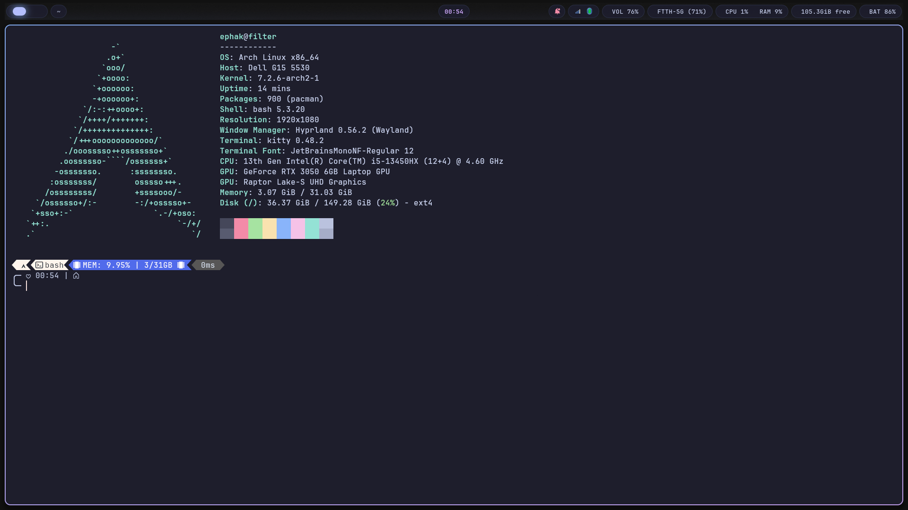

# hyprland-rice

Hyprland desktop configuration for Arch Linux. Catppuccin Mocha color scheme, Lua-based Hyprland config (0.56+), managed with chezmoi.



## Stack

| Role | Tool |
|---|---|
| Compositor | [Hyprland](https://hyprland.org) |
| Bar | [waybar](https://github.com/Alexays/Waybar) |
| Launcher | [wofi](https://sr.ht/~scoopta/wofi/) |
| Terminal | [kitty](https://sw.kovidgoyal.net/kitty/) |
| Notifications | [swaync](https://github.com/ErikReider/SwayNotificationCenter) |
| Window switcher | [hyprshell](https://github.com/H3rmt/hyprshell) |
| Lock / idle / wallpaper daemon | hyprlock, hypridle, hyprpaper |
| Wallpaper picker | [waypaper](https://github.com/anufrievroman/waypaper) |
| Power menu | [wlogout](https://github.com/ArtsyMacaw/wlogout) |
| OSD | [swayosd](https://github.com/ErikReider/SwayOSD) |
| Screenshot annotation | [satty](https://github.com/gabm/satty) |
| Clipboard history | [cliphist](https://github.com/sentriz/cliphist) |
| Settings panel | GNOME Control Center |
| Dotfile management | [chezmoi](https://www.chezmoi.io) |

## Notes on specific components

- **swaync** is configured with `title`, `dnd`, `mpris`, `calendar`, and `notifications` widgets, so the panel covers do-not-disturb, media control, and a calendar in addition to notifications.
- **waybar** modules use explicit text labels (`CPU`, `RAM`, `VOL`, `BAT`, `WiFi`) rather than bare icon+percentage. Several modules have `on-click-right` bound to the relevant settings panel or tool (e.g. the battery module opens the power settings panel, CPU/RAM open `gnome-system-monitor`).
- **hyprshell** replaces Hyprland's default focus-cycling Alt-Tab with a windowed switcher (config in `.config/hyprshell/config.ron`).
- Window minimize/restore is implemented via a special workspace (`SUPER+H` moves the active window to `special:minimized`, `SUPER+SHIFT+H` toggles it back into view), since Wayland has no native minimize concept.
- Animation curves use an expo-out bezier (`{0.16, 1}, {0.3, 1}`) instead of Hyprland's default, to avoid overshoot/bounce.
- Screenshot binds pipe `grim`/`slurp` output into `satty` for annotation before saving/copying.
- `kitty.conf` maps `Ctrl+Plus`/`Ctrl+Minus`/`Ctrl+0` to `change_font_size`, matching the convention most browsers use for page zoom.

## Keybindings

`SUPER` = Super/Windows key.

| Bind | Action |
|---|---|
| `SUPER + Return` / `SUPER + T` | Open terminal |
| `SUPER + R` | Open launcher |
| `SUPER + E` | Open file manager |
| `SUPER + I` | Open settings |
| `SUPER + W` | Wallpaper switcher |
| `SUPER + L` | Lock screen |
| `SUPER + /` | List keybinds (reads live from `hyprctl binds`) |
| `SUPER + SHIFT + E` | Power menu |
| `SUPER + SHIFT + V` | Clipboard history |
| `CTRL + W` | Close tab/window (handled by the app, not a global bind) |
| `SUPER + Q` | Close active window |
| `SUPER + SHIFT + Q` | Exit Hyprland |
| `SUPER + V` | Toggle floating |
| `SUPER + F` | Toggle fullscreen |
| `SUPER + P` | Toggle pseudotile |
| `SUPER + J` | Toggle split direction |
| `SUPER + arrows` | Move focus |
| `SUPER + SHIFT + arrows` | Move window |
| `SUPER + [1-0]` | Switch workspace |
| `SUPER + SHIFT + [1-0]` | Move window to workspace |
| `SUPER + S` | Toggle scratchpad |
| `SUPER + H` / `SUPER + SHIFT + H` | Minimize / restore window |
| `ALT + Tab` (hold) | Window switcher |
| `Super_L` (tap) | Overview/launcher |
| `Print` / `SHIFT + Print` | Screenshot region/fullscreen, opens in satty |
| `SUPER + SHIFT + R` | Toggle screen recording |
| Volume / brightness keys | OSD via swayosd |

## Install

This repo mirrors `~/.config`. It's chezmoi-managed but not written as a generic installer — check paths/assumptions against your own hardware before applying, particularly anything GPU- or hardware-specific in `hyprland.lua`.

```bash
chezmoi init --apply <this-repo-url>
```

Or copy `.config/*` directly into `~/.config/` if not using chezmoi.

Packages referenced (Arch names): `hyprland waybar wofi kitty swaync hyprshell-bin hyprlock hypridle hyprpaper waypaper wlogout swayosd satty cliphist wl-clipboard gnome-control-center`.

## License

MIT.
